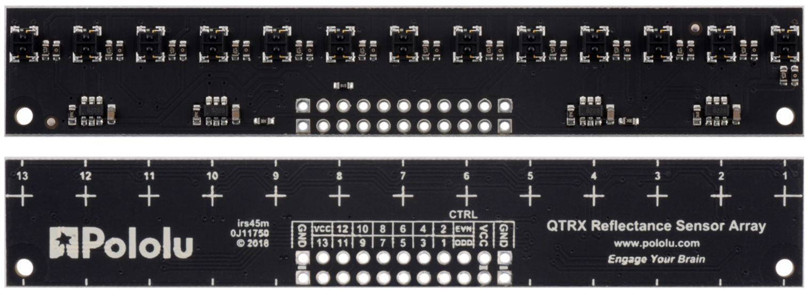
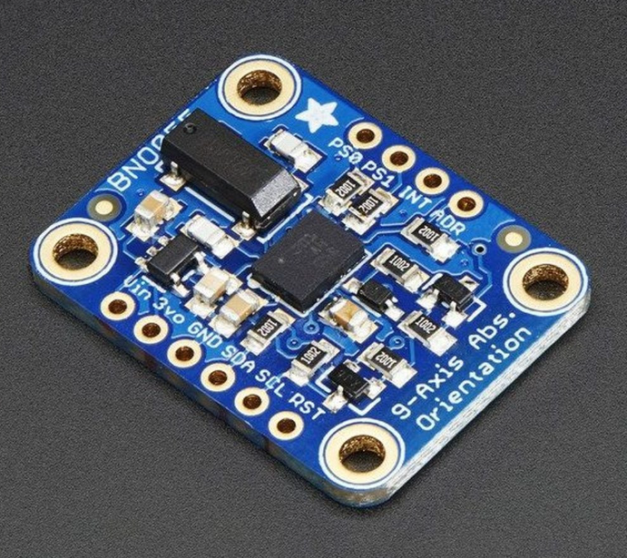
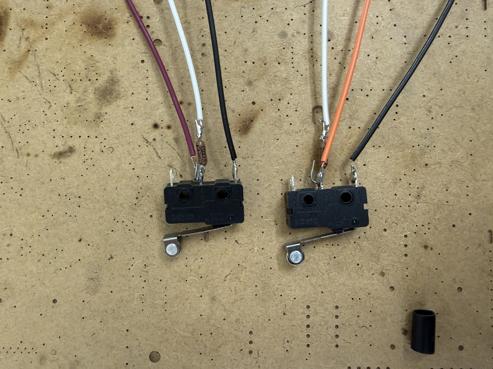
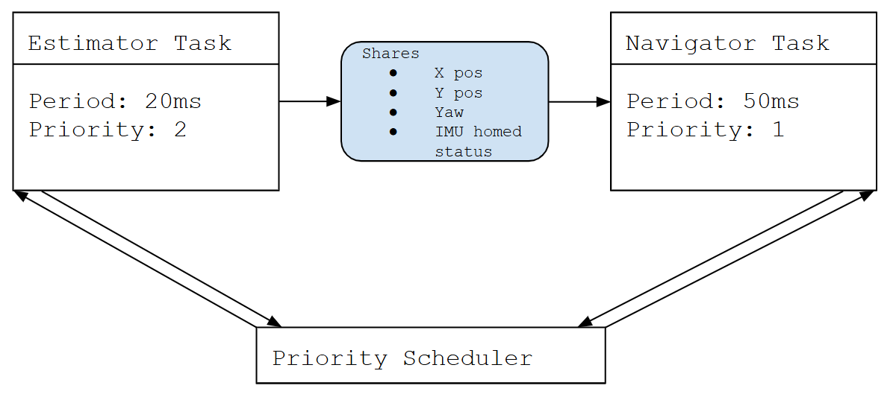
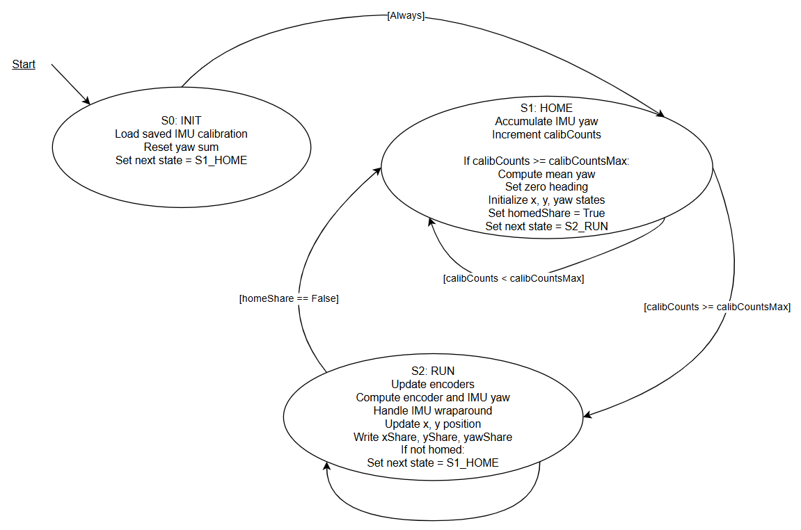

# ME405 Final Project Report
This page will go over our groups hardware and software solution to complete the final obstacle course using our Romi Robot. 

The goal of this final project was to have the Romi complete an obstacle course. The obstacle course included line following, bump sensing, and location estimation challenges. To complete this task, our team relied on sensor data from hardware and algorithms implemented in software. This page will review our final design and implementation.  

## Hardware
### Romi
The main hardware used was the Romi robot. The Romi robot is a differential drive robot with two DC motor powered wheels. It uses 70 mm diameter wheels and has a chassis diameter of about 165 mm. The Romi utilized a power distribution & motor driver combination PCB. The DC motors were integrated with quadrature encoders and operated via PWM. The Romi operated off of AA batteries in a 6S configuration (6 AA batteries in parallel), outputting approximately 8.4V nominally. 

### Sensors
#### Encoders
The Romi uses quadrature incremental encoders attached to the motors to measure wheel rotation. These encoders generate two digital signals that are offset in phase, allowing both the amount of rotation and the direction of motion to be determined. In this project, the STM32 timer hardware was used in encoder mode to read the pulses efficiently. The encoder counts were then used to track wheel position, and the change in counts over time was used to calculate wheel velocity.
#### Line Sensor
The line sensor used was a QTRX-MD-13A analog reflectance sensor array with 13 sensors spaced at 8 mm pitch, though only 9 sensors were used in this project. The board was powered from a 3.3V supply from the STM32 NUCLEO board. Each sensor on this array output analog voltages based on surface reflectivity. These analog readings were calibrated and used to generate a centroid value, which provided an estimate of the line position for line following.

#### IMU
The system uses a BNO055 inertial measurement unit, which integrates a 3-axis accelerometer, gyroscope, and magnetometer. The sensor operates over I2C and performs onboard sensor fusion to provide orientation data directly as Euler angles (roll, pitch, and yaw). The IMU also provides angular velocity measurements from the gyroscope. The main data captured from the IMU was the YAW of the Romi for navigation control without using the line sensor. 

#### Bump Sensors
The system uses snap-action SPDT mechanical switches as bump sensors to detect collisions with obstacles. Each switch is connected with an external pull up resistor that we integrated into the cable/harness of each bump sensor, creating an active low digital input to the microcontroller. Two sensors (left and right) were placed in the front of Romi and was used to detect which side of the robot encountered an obstacle. When the switch is pressed, the input is pulled low, indicating the Romi has bumped into an obstacle. 

#### Battery Sensing
We included sensing of the battery voltage to display the SOC of our batteries as well as generate a GAIN scaler that we could apply to our motor gains as the batteries discharged. The gain scaler was never implemented.
Because the battery voltage was larger than the maximum input voltage of 3.3V, a voltage divider was used to scale down the voltage from a maximum voltage of approximately 9V to approximately 2.93V.

### Control System
#### STM32 w/ Shoe of Brian
The system is controlled using an STM32 Nucleo-L476RG microcontroller running MicroPython. The Nucleo interfaces with all sensors and actuators (motors) and executes the main control logic. 

A Shoe of Brian board was used as an interface when working with MicroPython, allowing us to upload micropython program files such as main scripts, drivers, and task files.
### Communication System
#### Communication Module (ESP32)

### Custom 3D Prints
Custom hardware was 3D printed to allow for the bump sensors to be placed infront of the Romi without interfering with the line sensor. The custom mount was also given a "C" shape to be able to securely move solo cups around the obstacle course for bonus points; although this feature was never utilized as we did not attempt to move any cups.
### NUCELO Pinout
Below, a table is shown documenting our final pinout of the NUCLEO board to all of the Romi sensors and motors, including power distribution and I/O

| Pin | Function | Description | Cable |
|-----|--------|------------|--------|
| **NUCLEO Power IN** ||||
| Vin | Vin Power IN | VSW (battery voltage after switch), VSW_nom = 8.4V | Nucleo Power Cable [Red] |
| GND | GND | Connected to Power Distribution Board GND | Nucleo Power Cable [Black] |
| **RIGHT Motor Control** ||||
| PA_0 | PWM2/1 Input | RIGHT motor encoder CH.A | Encoder Cable [Blue] |
| PA_1 | PWM2/2 Input | RIGHT motor encoder CH.B | Encoder Cable [Yellow] |
| PB_5 | GPIO Output | RIGHT motor direction (0 = FWD; 1 = REV) | Motor Control Cable [Blue] |
| PB_3 | GPIO Output | RIGHT motor SLEEP (0 = Sleep; 1 = Enabled) | Motor Control Cable [Yellow] |
| PA_10 | PWM1/3 Output | RIGHT motor PWM (effort) | Motor Control Cable [Green] |
| **LEFT Motor Control** ||||
| PA_6 | PWM3/1 Input | LEFT motor encoder CH.A | Encoder Cable [Blue] |
| PA_7 | PWM3/2 Input | LEFT motor encoder CH.B | Encoder Cable [Yellow] |
| PC_7 | GPIO Output | LEFT motor direction (0 = FWD; 1 = REV) | Motor Control Cable [Blue] |
| PA_9 | GPIO Output | LEFT motor SLEEP (0 = Sleep; 1 = Enabled) | Motor Control Cable [Yellow] |
| PA_8 | PWM1/1 Output | LEFT motor PWM (effort) | Motor Control Cable [Green] |
| **IMU BNO055** ||||
| 5V | 5V Power OUT | Vin to IMU (5V nominal) | IMU Cable [Red] |
| GND | GND | GND to IMU | IMU Cable [Black] |
| PB_11 | I2C1_SDA | IMU I2C Data | IMU Cable [Yellow] |
| PB_10 | I2C1_SCL | IMU I2C Clock | IMU Cable [Blue] |
| PC_10 | GPIO Output | IMU Reset (0 = RST; 1 = nRST) | IMU Cable [Green] |
| **Line Sensor** ||||
| 3V3 | 3V3 Power OUT | Vin to Line Sensor | Line Sensor Cable [Orange] |
| GND | GND | GND to Line Sensor | Line Sensor Cable [Brown] |
| PA_0 | AnalogIn | Reflectance Sensor Input | Line Sensor Cable [Brown] |
| PA_1 | AnalogIn | Reflectance Sensor Input | Line Sensor Cable [Brown] |
| PA_2 | AnalogIn | Reflectance Sensor Input | Line Sensor Cable [Brown] |
| PA_3 | AnalogIn | Reflectance Sensor Input | Line Sensor Cable [Brown] |
| PA_4 | AnalogIn | Reflectance Sensor Input | Line Sensor Cable [Brown] |
| PA_5 | AnalogIn | Reflectance Sensor Input | Line Sensor Cable [Brown] |
| PC_3 | AnalogIn | Reflectance Sensor Input | Line Sensor Cable [Brown] |
| PC_2 | AnalogIn | Reflectance Sensor Input | Line Sensor Cable [Brown] |
| PC_5 | AnalogIn | Reflectance Sensor Input | Line Sensor Cable [Brown] |
| **Bump Sensors (x2)** ||||
| 3V3 | 3V3 Power OUT | Pulled-up supply to bump sensors | Bump Sensor Cable [White] |
| GND | GND | GND to bump sensors | Bump Sensor Cable [Black] |
| PC_4 | GPIO Input | Left bump (Active LO) | Bump Sensor Cable [Purple] |
| PH_0 | GPIO Input | Right bump (Active LO) | Bump Sensor Cable [Orange] |
| **ESP32 (WiFi Module)** ||||
| 3V3 | 3V3 Power OUT | Vin to ESP32 | ESP32 Cable [White] |
| GND | GND | GND to ESP32 | ESP32 Cable [Grey] |
| PC_12 | Serial_TX | RX2 (ESP32) | ESP32 Cable [White] |
| PD_2 | Serial_RX | TX2 (ESP32) | ESP32 Cable [Purple] |
| **VSENSE_BAT** ||||
| PB_1 | AnalogIn | Battery voltage sense (via divider) | Custom Cable |

## Software

- Language
- Drivers
- Shares
- Tasks
- UI (Real Time Course Tracking)

